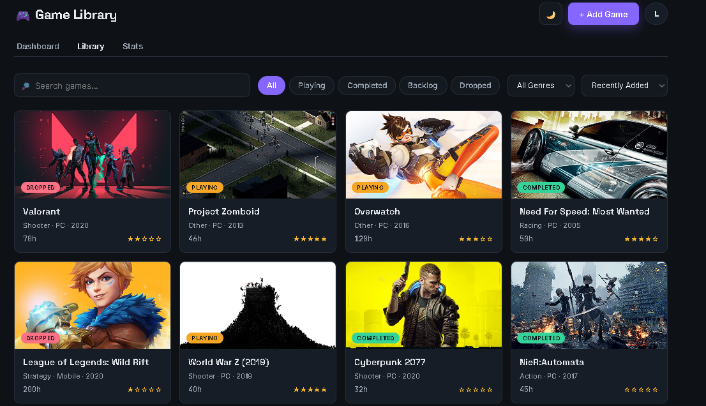
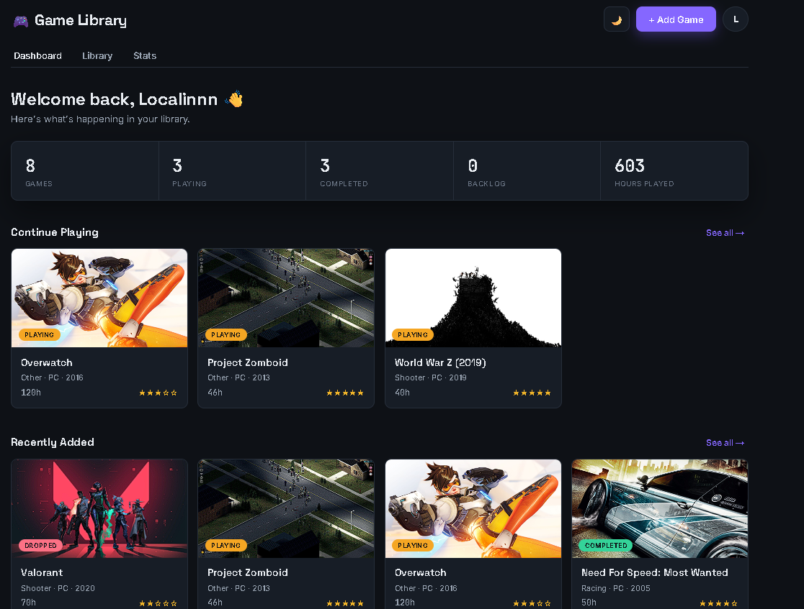
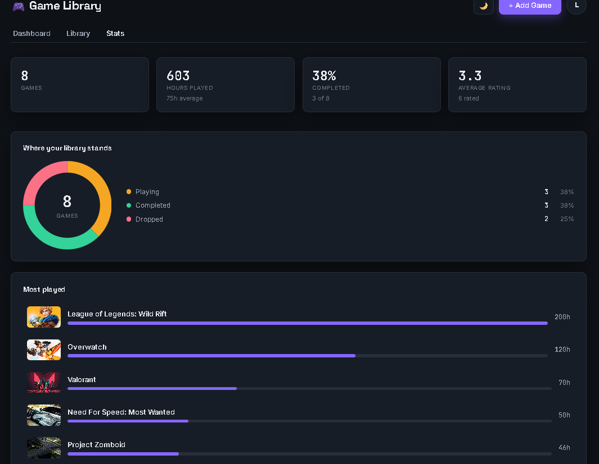

# Game Library

Keep track of the games you own, how long you've played them, and what you thought of them.

[**Open the app**](https://localintheengineer.github.io/game-library/) — the API sleeps when nobody is using it, so the first request can take up to a minute.







## What it does

Create an account and start adding games. Type a title and the app searches RAWG for it, then fills in the genre, platform, release year, and cover art — you only set the things that are yours: status, hours, rating, notes.

The dashboard shows where your library stands at a glance. The stats page breaks it down further: completion rate, hours by genre, which platforms you actually play on, how generous you are with ratings.

Libraries are private. If you want to show yours off, turn on a public profile and you get a link anyone can open. It shows your games, hours, and ratings, but never your notes.

## Built with

React and Vite on the front end. Node, Express, and PostgreSQL on the back. Game data comes from the [RAWG API](https://rawg.io/apidocs).

## Running it locally

You'll need Node 18+ and PostgreSQL 14+.

Create a database:

```bash
createdb game_library
```

Copy the environment template and fill it in:

```bash
cd server
cp .env.example .env
```

`DATABASE_URL` points at the database you just created. `JWT_SECRET` signs login tokens and should be long and random:

```bash
node -e "console.log(require('crypto').randomBytes(48).toString('hex'))"
```

`RAWG_API_KEY` is free from rawg.io/apidocs. Without it the app still works, you just have to type game details in by hand.

Then, from the project root:

```bash
npm run install:all
npm run db:migrate
npm run dev
```

The API runs on port 4000, the client on 5173. Vite proxies `/api` across, so nothing else needs configuring.

## How the data is arranged

Three tables. `users` holds accounts. `games` is a shared catalogue — one row per game, no matter how many people own it. `user_games` sits between them and holds everything personal: status, hours, rating, notes.

That split is what lets two people track the same game without stepping on each other. Delete a game from your library and the catalogue entry stays put for everyone else.

The database enforces its own rules rather than trusting the API to get it right: status has to be one of four values, ratings stay between 0 and 5, hours can't go negative, and you can't add the same game to your library twice.

## API

Everything lives under `/api`. All of it needs an `Authorization: Bearer <token>` header except registration, login, and public profiles.

| Method | Path | |
| --- | --- | --- |
| POST | `/auth/register` | Create an account |
| POST | `/auth/login` | Sign in |
| GET | `/auth/me` | Who am I |
| PATCH | `/auth/me` | Make my profile public or private |
| GET | `/games` | My library |
| POST | `/games` | Add a game |
| PUT | `/games/:id` | Update an entry |
| DELETE | `/games/:id` | Remove an entry |
| GET | `/search?q=` | Search RAWG |
| GET | `/profiles/:username` | Someone's public library |

A private profile and a username that doesn't exist return the same response, so you can't use the API to find out who has an account here.

## Deployment

The database runs on Neon, the API on Render, and the client on GitHub Pages.

Render builds from the `server` directory and runs `npm start`, which applies the schema before booting. It needs `DATABASE_URL`, `JWT_SECRET`, `RAWG_API_KEY`, and `CORS_ORIGINS` set in its dashboard.

The client is built with the API address baked in, then pushed to the `gh-pages` branch:

```bash
cd client
npm run build
npx gh-pages -d dist
```

`VITE_API_URL` comes from `client/.env.production`.

Public profiles use hash routing (`#/u/username`) because GitHub Pages serves static files and can't rewrite unknown paths to `index.html`.

## Background

This started as a plain HTML page with localStorage and grew a layer at a time — React, then an Express API, then PostgreSQL, then accounts, then everything else. The commit history follows that order if you want to see how it got here.

| | |
| --- | --- |
| v1 | HTML, CSS, JavaScript, localStorage |
| v2 | React and Vite |
| v3 | Express API, JSON file storage |
| v4 | PostgreSQL |
| v5 | RAWG search and cover art |
| v6 | Accounts and JWT auth |
| v7 | Charts, responsive layout, loading states |
| v8 | Public profiles |
